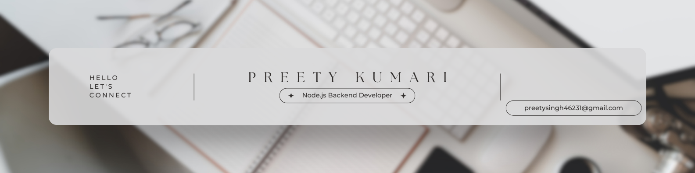

  

<h1 align="center">Hi 👋, I'm Preety Kumari</h1>
<h3 align="center">💻 Node.js Backend Developer</h3>

---

## 🚀 About Me

Passionate Backend Developer with 1 year of professional experience crafting scalable and secure REST APIs using **Node.js, TypeScript, NestJS, and Prisma**.

I specialize in:

- ⚡ High-performance API development
- 🗄 PostgreSQL/MySQL optimization
- 🛡 Authentication (JWT, RBAC)
- ☁ AWS S3 integrations
- 🔗 Zoho APIs & third-party integrations
- 💳 EMI scheduling & payments module (auto-schedule, calculations & payment tracking)

I love building **clean code**, **efficient systems**, and improving performance using optimized database queries.

---

<h2 align="center">🚀 Languages and Tools: </h2>
 
<h4>&nbsp;Tech Stack..</h4>
 

 &nbsp;&nbsp;
 &nbsp;&nbsp;
 &nbsp;&nbsp;
 &nbsp;&nbsp;

 
&nbsp;&nbsp;
 &nbsp;&nbsp;
 &nbsp;&nbsp;
 &nbsp;&nbsp;
  

&nbsp;&nbsp;
&nbsp;&nbsp;
&nbsp;&nbsp;
 

 

  &nbsp;&nbsp;
  &nbsp;&nbsp;
  &nbsp;&nbsp;
  &nbsp;&nbsp;
  
 &nbsp;&nbsp;
 &nbsp;&nbsp;
  &nbsp;&nbsp;
   
  &nbsp;&nbsp;
  &nbsp;&nbsp;
  

 

 

## 🌐 Connect With Me

- 🔗 **LinkedIn:** https://linkedin.com/in/preety-kumari-25380b190
- 🌍 **Portfolio:** https://superb-dieffenbachia-faa42a.netlify.app/
- ✉ **Email:** preetysingh46231@gmail.com

---

✨ Thanks for visiting — Have a great day! ✨
 -->
